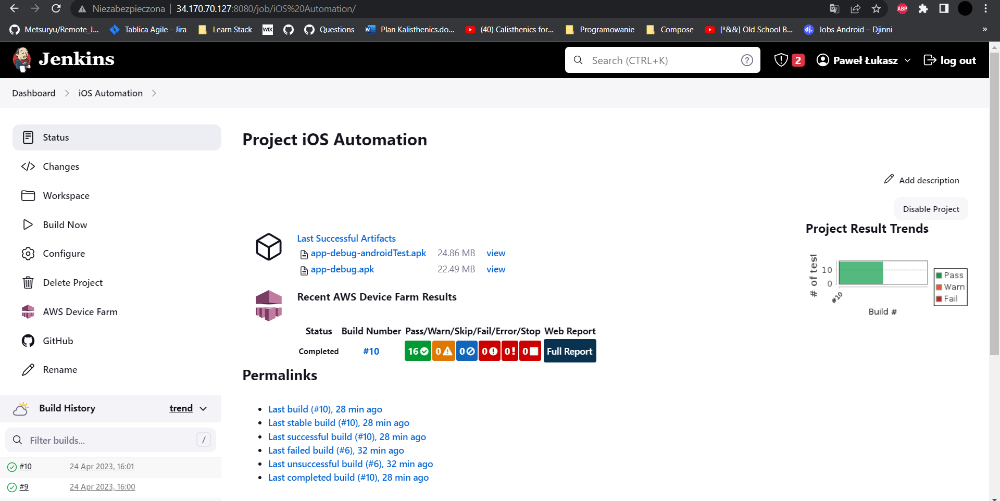
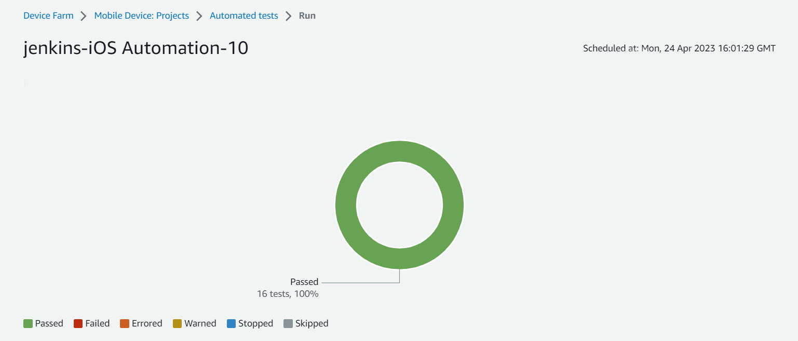
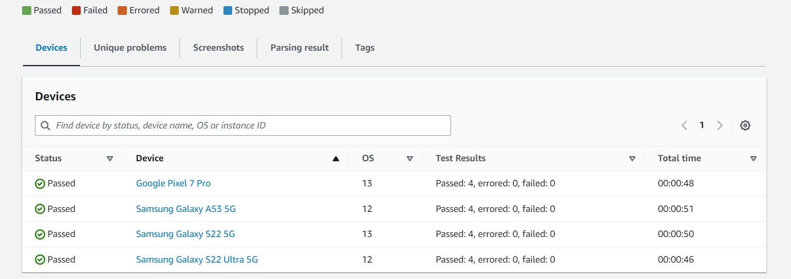
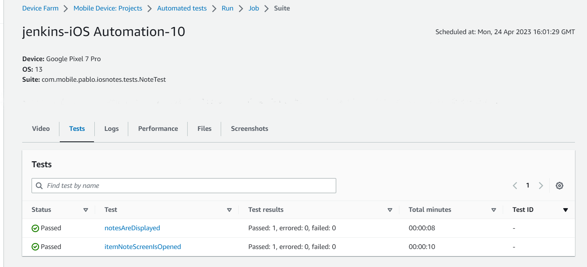

# Noteworthy - Android App 🚀

 

🌟 Welcome to the ultimate notes app for Android,  
designed with a sleek interface and packed with 
powerful features to help you stay organized! 🌟
 

## 🎯 Features 

* Image loading
* Unlock via face recognition
* Edit checkpoints

## 🛠️ Tech stack

* Jenkins via GCP + AWS Device farm
* Github Actions (CodeQL, Branch closing,Build Apk, Stale issues)
* Room
* MVVM
* Coil
* Coroutines
* Compose
* Compose Navigation
* Ktlint
* StateFlow / Flows / Channels
* Side Effect Handlers
* Multi-Module & inner module
* Migrate dependencies to toml
* Permissions via Accompanist
* Dagger + Hilt
* Benchmark + Baseline
* Kotlin DSL
* Jira board at https://mobile-pablo.atlassian.net/

## 🎨 Screenshots
* Screenshots with templates be added soon

## 🪄 Jenkins setup

Jenkins is stored at Google Cloud Platform and uses AWS Device Farm for testing.  
Its stored on 34.170.70.127:8080, For saving money I am turning off page when not needed 
Unfortunately I had to upload apk files here for jenkins view.  
  
  
  
  

## 📈 Tasks to be done

* Add animation for navigation
* Espresso tests
* Expand more benchmark tests
* Unit Tests
* Swipe with NoteLines  (checklist/delete)
* Notifications / FCM
* Crashalitics
* Wiki
* Deeplink / Google dynamic link
* Google Analytics
* Add settings with dark mode
* OSS Libraries list
* Biometric login / PIN / Face recognision
* Add DataStore + Probuff
* Config R8
* Use https://github.com/DevSrSouza/compose-icons
* Publish on Google Play
* Clean Readme.MD with splash photos
* https://github.com/ValeryPonomarenko/compose-shimmer

## 📖 License 

